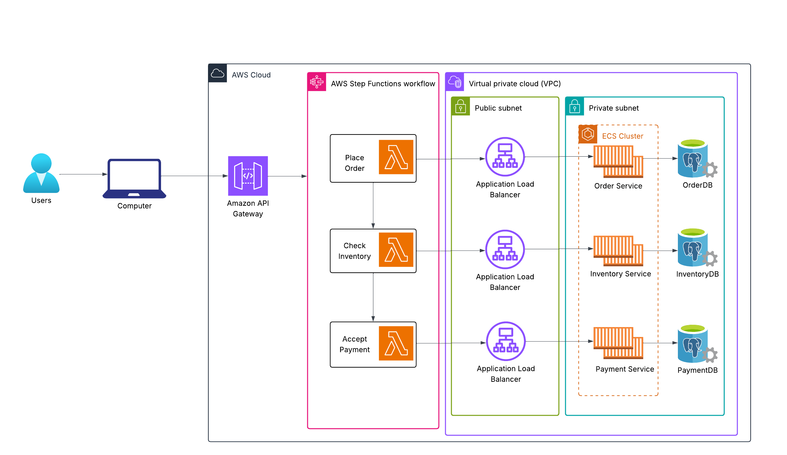

# Saga Pattern Demonstration: Order System in AWS

This is a demonstration of the Saga pattern at work with an example ordering system.  It uses a flow defined by AWS Step Functions and calls Java Spring Boot microservices, each with its own PostgreSQL datastore. 

1) The order lambda takes an order request from the user, creates an order using the Order Service and checks inventory to see if there is enough of each item to fufill an order.  
2) The inventory lambda decrements inventory to fufill the order then performs a callback on the Order Service with the items and prices for the order 
3) The payment service is called.  If there is an error processing the payment, a delta is performed on the order and inventory services to roll back the transaction. 

