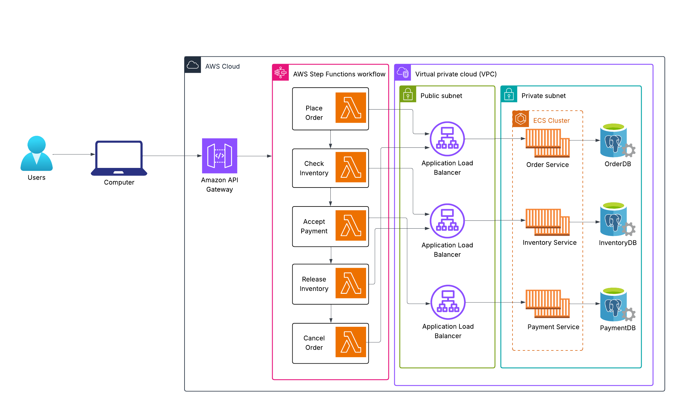

# Saga Pattern Demonstration: Order System in AWS

This is a demonstration of the Saga pattern at work with an example ordering system.  It uses a flow defined by AWS Step Functions and calls Java Spring Boot microservices, each with its own PostgreSQL datastore. 

### High-Level Architecture ###

### State Machine ###

Here is a breakdown of each state in the state machine:

1) **OrderService**: The order lambda receives an order POST request from the user, creates an order using the Order Service in ECS 
2) **InventoryService**: The Inventory Service in ECS decrements inventory to fufill the order 
3) **CheckInventory**: This choice state checks for the response of the InventoryService. If it is `200` (OK), then PaymentService is called.  If InventoryService returns a `404` because one or more of the product items in the order exceeds the available quantity, CancelOrder is called and the saga ends 
4) **PaymentService**: This service returns a `200` (OK) or `402` (PAYMENT REQUIRED). For testing purposes one out of every three attempts will be a failure.  
5) **CheckPayment**: This choice state checks for the response of the PaymentService and completes the saga if a `200` is received or invokes ReleaseInventory if a 402 was returned. 
6) **ReleaseInventory**: This is the _compensation_ for the inventory that was subtracted in the InventoryService state.  The previously subtracted inventory is added back to the _inventory_ table for the product.
7) **CancelOrder**: This is the _compensation_ for the order that was created by the OrderService.  The order status is marked CANCELED. 

This is the state machine showing the states when an order is cancelled and inventory is restored because payment was not approved.

Here is the state machine showing the states when an order is cancelled because there is not enough inventory for an item.

This is the state machine showing the states when an order is successful.

## Building the project ## 

## Local Build ## 

To run each Spring Boot microservice locally you must have Docker installed.  Each service(e.g order-service in /apps folder) has its own bash script, `deploy-local.sh`.  Execute that script and both a Java container and PostgreSQL container will be created and run.

| Service Name | Base URL | 
|----------|----------|
| order-service | http://localhost:8080 |
| inventory-service | http://localhost:8081 |
| payment-service | http://localhost:8082 |

## Deploy to AWS ##

To provision resources in AWS with Terraform and push containers to your ECR repository run `deploy.sh` at the project root.  

Be sure to change `terraform.tfvars` to use your ECR repository. It's best to create the repo before running the script. 

